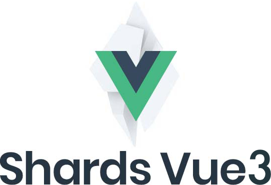

<p align="center">

</p>

<p align="center">
Shards Vue 3 is a free, beautiful and modern Vue 3 UI kit <br /> based on <a href="https://github.com/designrevision/shards-ui">Shards</a>.
</p>

<br />

<p align="center">
  <a href="#">
    
  </a>
  <a href="https://twitter.com/designrevision">
    
  </a>
</p>

<br />


### Introduction
This package is based on [Vue 2 shards-vue](https://github.com/DesignRevision/shards-vue) version. The components are the exact same, so the [Official Documentation](https://designrevision.com/docs/shards-vue) is still useful.
However this package contains a lot of improvements such as:
 - Vue 3 compatibility
 - Updated packages and less vulnerabilities
 - Webpack build included
 - Bug fixes


### Quick Start

You can install Shards Vue 3 including the following dependency to your `package.json`

```js
"shards-vue3": "git+git@github.com:maiquelcraash/shards-vue3.git#master"
```
Then, just update your modules with
```bash
// If using NPM
npm install

// If using Yarn
yarn
```

<br />

### Module Bundlers

If you are using a module bundler such as [Webpack](https://webpack.js.org/) or [Rollup](https://rollupjs.org/), you can include the entire Shards Vue library inside your project.

```javascript
import { createApp } from 'vue'
import ShardsVue from 'shards-vue3'

// Import base styles (Bootstrap and Shards)
import 'bootstrap/dist/css/bootstrap.css'
import 'shards-ui/dist/css/shards.css'

const app = createApp({ });
app.use(ShardsVue);
app.mount('#app')
```

<br />

### Registering Components as Vue Plugins

If you'd like to register only certain components as Vue plugins, make sure to import just the component you'd like to use.

```javascript
import { createApp } from 'vue'

// Import base styles (Bootstrap and Shards)
import 'bootstrap/dist/css/bootstrap.css'
import 'shards-ui/dist/css/shards.css'

import { Button } from 'shards-vue3/src/components'
const app = createApp({ });
app.use(Button);
app.mount('#app')

```

<br />

### Importing Single File Components

Importing single file components is also possible.

```vue
<template>
    <d-button @click="handleClick">Click Me!</d-button>
</template>

<script>
import dButton from 'shards-vue/src/components/button/Button'

export default {
    components: {
        dButton
    },
    methods: {
        handleClick() {
            alert('You just clicked me!')
        }
    }
}
</script>
```

<br />

### Breaking Changes v2 to v3
 - `v-model` on child components https://v3-migration.vuejs.org/breaking-changes/v-model.html

<br />

### Build

```
$ npm run build
```

<br />

### Contributing

Please read [CONTRIBUTING.md](CONTRIBUTING.md) for details on our code of conduct, and the process for submitting pull requests to us.

If you'd like to fix a bug or work on a feature, make sure to follow the steps below in order to setup the development environment on your local machine:

1. Clone the repository.
2. Run `npm install` to install all required dependencies.
3. Run `npm run sandbox` in order to kickstart the server and run the sandbox with hot reloading.
4. Refer to the `sandbox/Sandbox.vue` file for more details.

<br />
